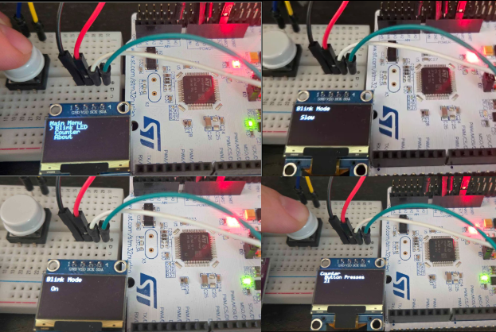
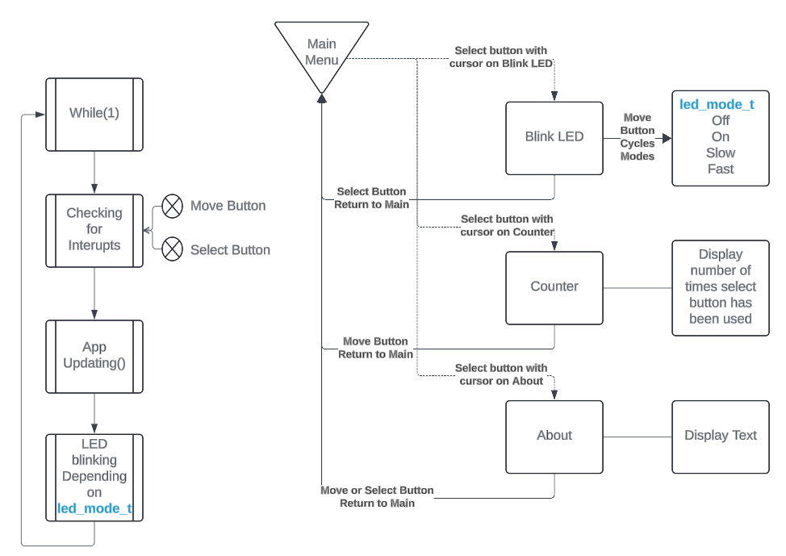
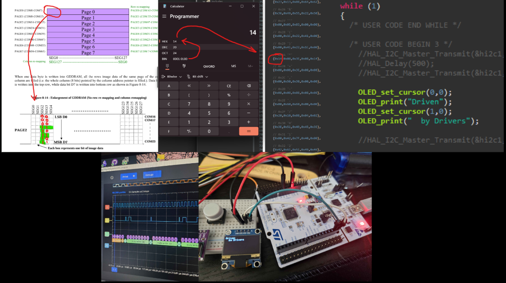
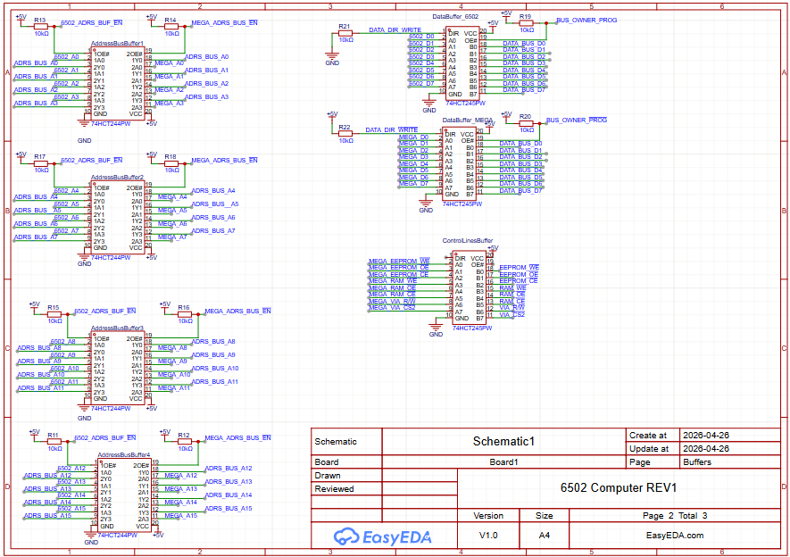

# c_coding_upskilling_journey

This repository documents my journey learning low-level software development in C, from fundamentals all the way down to systems and embedded programming.

The goal is not just to learn syntax, but to understand how computers actually work beneath the abstraction layers.


<!-- CLOC-START -->
```text
cloc stats (06/10/2026)
github.com/AlDanial/cloc v 1.98  T=0.02 s (1357.5 files/s, 267210.0 lines/s)
-------------------------------------------------------------------------------
Language                     files          blank        comment           code
-------------------------------------------------------------------------------
C                               18           1243            854           3181
C/C++ Header                     9            164            139            352
Markdown                         1             20              2             62
YAML                             1             11              0             40
Python                           1              5             14             13
Text                             1              0              0              2
-------------------------------------------------------------------------------
SUM:                            31           1443           1009           3650
-------------------------------------------------------------------------------
```
<!-- CLOC-END -->

Topics and projects in this repository will include:

Core C programming fundamentals
Memory management and pointers
Data structures and algorithms
Linux systems programming
Embedded systems development
Raspberry Pi and microcontroller interfacing
Serial communication and hardware protocols
Driver development
6502 computer interfacing and tooling
Low-level debugging and hardware interaction

Long term goals:

Contribute to Linux kernel development
Build embedded tooling and device drivers in C
Interface a Raspberry Pi with a custom 6502 computer
Develop a deeper understanding of operating systems and computer architecture

This repository is intentionally structured as a learning log. Some projects are small experiments, others are larger builds, but all represent forward progress toward becoming a stronger systems and embedded developer.

Current areas of focus:

CLI utilities in C
Parsing and string handling
Memory and pointer mechanics
Linux filesystem and process fundamentals
Embedded communication between systems

Tools and platforms:

Linux / WSL2
Raspberry Pi
ESP32
STM32
Logic analyzers, oscilloscopes, and serial debugging tools

The goal is simple:
Keep building. Keep learning. Get closer to the metal.

## OLED Menus


## OLED Menu State Machine


## OLED SSD1306 Driver for STM32 Nucleo Board


## 6502 Computer Project
Custom PCB work for my 6502 computer project.

### PCB Render


### Bus Buffering Concept
